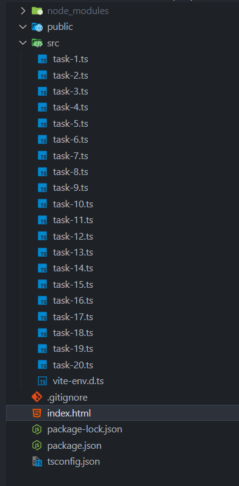

# react-blended-01


## Технічне завдання

- Створіть командний проєкт за допомогою [Vite](https://vitejs.dev/).
- Налаштуйте його та додайте усіх учасників.
- Для кожної задачі створіть TypeScript файл у папці src, який містить код завдання, тобто від task-1.ts до task-20.ts.

У тебе має вийти наступна структура проєкту:




## Задача 1

### Опис: 
Є об'єкт settings, який містить налаштування.

```
const settings = {
  darkMode: true,
  fontSize: 16,
  language: "en",
};
```

### Завдання:
  1. Створіть тип Settings, який описує цей об'єкт.
  2. Типізуйте settings через цей тип.


## Задача 2

### Опис:
Є функція, яка приймає суму (число) та тип валюти.

```
function convertCurrency({amount, currency}) {
  console.log(`Converting ${amount} to ${currency}`);
}
```

### Завдання:
  1. Типізуйте параметри функції дозволивши властивості currency лише одне із значень "USD", "EUR", "UAH".
  2. Типізуйте повернення функції.


## Задача 3

### Опис:
Є об\'єкт користувача:

```
const user= { id: "1", name: "Charlie", age: 25, active: true };
```

### Завдання:
  1. Типізуйте user.
  2. Зробіть властивість id тільки для читання.


## Задача 4

### Опис:
Є масив, який містить розміри екрана у пікселях.

```
const dimensions = [1920, 1080];
```

### Завдання:
  1. Додайте до змінної dimensions явну типізацію.
  2. Переконайтеся, що TypeScript не дозволяє додавати до масиву значення інших типів (наприклад, рядки).


## Задача 5

```
function createUser({name, age}) {
  return {
    name,
    age,
    isAdmin: false
  };
}

createUser({ name: "Alice", age: 30 });
```

### Завдання:
  1. Типізуйте функцію повністю: параметри і повернення функції.


## Задача 6

```
const user = {
  name: "Alice",
  address: {
    city: "Kyiv"
  }
};

console.log(user.address?.city);
```

### Завдання:
  1. Створіть тип для user.
  2. Зробіть address необов’язковим.
  3. Перевірте, що user.address?.city не викликає помилки.


## Задача 7

```
const users = [
  { name: "Alice", age: 30 },
  { name: "Bob", age: 25 },
];
```

### Завдання:
  1. Створіть інтерфейс User, який описує структуру об’єкта з іменем і віком.
  2. Типізуйте змінну users.
  3. Додайте ще одного користувача до масиву, дотримуючись структури.
  4. Переконайтеся, що TypeScript не дозволяє додати об’єкт без обов’язкових полів (name, age).


## Задача 8

```
enum Role {
  Admin,
  User,
  Guest
}
```

### Завдання:
  1. Створіть функцію getPermissions, яка приймає параметр role типу Role.
  2. Функція має повертати масив рядків, які описують права доступу для кожної ролі:
    - Admin має права: "create", "read", "update", "delete"
    - User має права: "read", "update"
    - Guest має лише право: "read"
  3. Типізуйте параметр і тип повернення функції getPermissions.
  4. Перевірте, що TypeScript не дозволяє передати в getPermissions значення, якого немає в Role.


## Задача 9

### Завдання:
  1. Створіть інтерфейс Container, що містить:
    - масив items однакового типу для зберігання елементів.
    - метод addItem, який додає елемент до контейнера.
    - метод getItem, який повертає елемент за індексом.
  2. Створіть два контейнери:
    - numberContainer, який містить числа та використовує відповідну типізацію.
    - stringContainer, який містить рядки та також використовує відповідну типізацію.
  3. Використовуйте методи addItem, getItem для перевірки роботи контейнера.
  4. Створіть функцію getLastElement, яка приймає масив елементів контейнера Container і повертає останній елемент масиву.
  5. Переконайтесь, що функція getLastElement працює коректно для різних типів контейнерів (масиви чисел, масиви рядків).

### Примітка:
  1. Контейнер має підтримувати тільки один тип елементів.


## Задача 10

У вас є масив імен користувачів:

```
const users = ["alice", "bob", "charlie"];
```

### Завдання:
  1. Створіть типізовану функцію toUserObjects, яка приймає масив рядків (імен користувачів).
  2. Усередині функції переберіть масив імен та для кожного імені створи об’єкт з такими властивостями:
    - id — порядковий номер (починаючи з 1),
    - name — саме ім’я користувача (рядок з масиву).
  3. Функція повинна повертати масив отриманих об’єктів.
  4. Переконайтеся, що результат функції має правильну типізацію, а TypeScript не видає помилок.

Приклад виклику:

```
toUserObjects(users);
// Повертає: [{ id: 1, name: "alice" }, { id: 2, name: "bob" }, { id: 3, name: "charlie" }]
```


## Задача 11

  1. Створіть власний тип User, який має:
      - обов'язкове поле username (рядок)
      - обов'язкове поле age (число)
      - опціональне поле city (рядок)
  2. Створіть літеральний тип Role, який може мати значення "admin", "user", "guest".
  3. Оголосіть функцію createUserCard, вона має приймати:
      - перший параметр — об'єкт типу <User>
      - другий параметр — роль користувача типу Role
  4. Функція повертає рядок у форматі "[username] ([age]) — [role] from [city]”.
Наприклад:

```
console.log(createUserCard({ username: "Anna", age: 25, city: "Kyiv" }, "admin"));
// Anna (25) — admin from Kyiv

console.log(createUserCard({ username: "Max", age: 30 }, "guest"));
// Max (30) — guest from Unknown
```
  5. Якщо city немає — виводьте "Unknown"


## Задача 12

Є функція sendDoneStatus:

```
function sendDoneStatus(callback) {
  callback("done");
}
```

### Завдання:
  1. Типізуйте параметр callback, щоб це була функція, яка приймає рядок і повертав void.


### Задача 13

Є функція reducer:

```
function reducer(state, action) {
  switch (action.type) {
    case "increment":
      return state + 1;
    case "decrement":
      return state - 1;
    default:
      return state;
  }
}
```

### Завдання:
  1. Типізуйте state як число.
  2. Створіть тип Action, що може приймати як значення лише рядки increment та decrement.
  3. Типізуйте функцію повністю.


## Задача 14

Функція fetchMessage повертає проміс, який повертає рядок.

```
function fetchMessage() {
  return new Promise((resolve) => {
    resolve("Hello from server!");
  });
}

fetchMessage().then(message => console.log(message));
```

### Завдання:
  1. Додайте до функції явну типізацію, яка вказує, що вона повертає проміс який приводиться до рядка.
  2. Переконайтеся, що якщо message має тип відмінний від рядка, то виникає помилка.


## Задача 15

Функція fetchProducts повертає проміс, який через затримку повертає список товарів.

Товар має такі поля:
  - id - число
  - title - рядок
  - price - число

```
function fetchProducts() {
  return new Promise((resolve) => {
    setTimeout(() => {
      resolve([
        { id: 1, title: "Laptop", price: 1000 },
        { id: 2, title: "Phone", price: 500 }
      ]);
    }, 1000);
  });
}

fetchProducts().then(products => console.log(products));
```

### Завдання:
  1. Оголоси тип Product для товару.
  2. Додайте до функції явну типізацію, вкажіть, що вона повертає проміс, який приводиться до масиву товарів.


### Задача 16

Функція fetchProfile повертає проміс, який через затримку повертає профіль користувача.

Профіль має такі поля:
  - username - рядок
  - age - число
  - isAdmin - boolean

```
function fetchProfile() {
  return new Promise((resolve) => {
    setTimeout(() => {
      resolve({ username: "max_123", age: 28, isAdmin: true });
    }, 1000);
  });
}

fetchProfile().then(profile => console.log(profile));
```

### Завдання:
  1. Оголосіть інтерфейс Profile.
  2. Додайте до функції явну типізацію, що вона повертає проміс, який приводиться до об'єкта профілю.


## Задача 17

Функція fetchUsers повертає проміс, який через fetch отримує список користувачів з API.
```
const fetchUsers = async () => {
  const response = await fetch("https://jsonplaceholder.typicode.com/users");
  const data = await response.json();
  return data;
};

fetchUsers().then((users) => console.log(users));
```

### Завдання:
  1. Оголосіть інтерфейс User для користувача (перевірте, які властивості користувача містяться у відповіді бекенда).
  2. Типізуйте функцію fetchUsers.


## Задача 18

Функція fetchUsers повертає проміс, який через axios отримує список користувачів з API.

```
import axios from "axios";

const fetchUsers = async () => {
  const response = await axios.get("https://jsonplaceholder.typicode.com/users");
  return response.data;
};

const getUsers = async () => {
  const users = await fetchUsers();
  console.log(users);
};

getUsers();
```

### Завдання:
  1. Оголосіть інтерфейс User для користувача (перевірте, які властивості користувача містяться у відповіді бекенда).
  2. Типізуйте функцію fetchUsers.


## Задача 19

Функція fetchUser повертає проміс, який через axios отримує одного користувача з API по userId.

```
import axios from "axios";

const fetchUser = async (userId) => {
  const response = await axios.get(`https://jsonplaceholder.typicode.com/users/${userId}`);
  return response.data;
};

const getUserName = async (id) => {
  const user = await fetchUser(id);
  console.log(user.name);
};

getUserName(1);
```

### Завдання:
  1. Оголосіть інтерфейс User для користувача (перевірте, які властивості користувача містяться у відповіді бекенда).
  2. Типізуйте функцію fetchUser.


## Задача 20

Функція fetchPosts повинна отримати список постів з API за допомогою бібліотеки axios.

```
import axios from "axios";

const fetchPosts = async () => {
  const response = await axios.get("https://jsonplaceholder.typicode.com/posts");
  return response.data;
};
```

### Завдання:
  1. Оголосіть інтерфейс Post для поста (перевірте, які властивості користувача містяться у відповіді бекенда).
  2. Типізуйте функцію fetchPosts, вказавши, що вона повертає проміс, який містить масив об'єктів типу Post.
  3. Оголосіть функцію logThreePosts, яка виведе в консоль дані перших 3 постів, виводячи їхні title та body.

